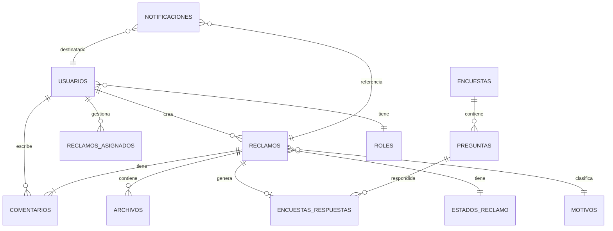

# Diseño de Base de Datos - Sistema de Reclamos

## 🗄️ Motor de Base de Datos

**PostgreSQL 15+**
- Robusto y confiable
- Open source
- Excelente rendimiento
- Soporte completo en .NET con Entity Framework Core

---

## 📊 Diagrama Entidad-Relación (Mermaid)



---

## 📋 Tablas Detalladas

### 1. USUARIOS (users)

Almacena todos los usuarios del sistema (clientes, agentes, admins)

```sql
CREATE TABLE usuarios (
    id SERIAL PRIMARY KEY,
    email VARCHAR(255) UNIQUE NOT NULL,
    password_hash VARCHAR(255) NOT NULL, -- Solo para usuarios con login
    nombres VARCHAR(100) NOT NULL,
    apellidos VARCHAR(100) NOT NULL,
    tipo_documento VARCHAR(10), -- 'DNI', 'RUC', 'PASAPORTE'
    numero_documento VARCHAR(20),
    telefono VARCHAR(20) NOT NULL,
    departamento VARCHAR(50),
    domicilio TEXT,
    rol_id INTEGER REFERENCES roles(id),
    es_cliente BOOLEAN DEFAULT FALSE,
    numero_suministro VARCHAR(50), -- Si es cliente
    email_verificado BOOLEAN DEFAULT FALSE,
    token_verificacion VARCHAR(255),
    fecha_registro TIMESTAMP DEFAULT CURRENT_TIMESTAMP,
    ultimo_acceso TIMESTAMP,
    activo BOOLEAN DEFAULT TRUE,
    
    CONSTRAINT email_valido CHECK (email ~* '^[A-Za-z0-9._%+-]+@[A-Za-z0-9.-]+\.[A-Za-z]{2,}$')
);

CREATE INDEX idx_usuarios_email ON usuarios(email);
CREATE INDEX idx_usuarios_documento ON usuarios(numero_documento);
CREATE INDEX idx_usuarios_rol ON usuarios(rol_id);
```

**Campos Clave:**
- `id`: Identificador único
- `email`: Email único para login
- `password_hash`: Contraseña hasheada (bcrypt)
- `rol_id`: Relación con tabla de roles
- `es_cliente`: Indica si tiene cuenta de cliente
- `numero_suministro`: Solo si es cliente activo

---

### 2. ROLES (roles)

Define los roles del sistema

```sql
CREATE TABLE roles (
    id SERIAL PRIMARY KEY,
    nombre VARCHAR(50) UNIQUE NOT NULL, -- 'CLIENTE', 'AGENTE', 'SUPERVISOR', 'ADMIN', 'EJECUTIVO'
    descripcion TEXT,
    permisos JSONB, -- Permisos en formato JSON
    fecha_creacion TIMESTAMP DEFAULT CURRENT_TIMESTAMP
);

-- Insertar roles por defecto
INSERT INTO roles (nombre, descripcion) VALUES
('PUBLICO', 'Usuario sin registro, solo puede crear reclamos'),
('CLIENTE', 'Cliente registrado con acceso a portal personal'),
('AGENTE', 'Agente de soporte que gestiona reclamos'),
('SUPERVISOR', 'Supervisor que asigna casos y ve reportes'),
('ADMINISTRADOR', 'Control total del sistema'),
('EJECUTIVO', 'Solo lectura de reportes estratégicos');
```

---

### 3. RECLAMOS (reclamos)

Tabla principal del sistema

```sql
CREATE TABLE reclamos (
    id SERIAL PRIMARY KEY,
    codigo VARCHAR(20) UNIQUE NOT NULL, -- REC-2025-0001
    fecha_reclamo TIMESTAMP DEFAULT CURRENT_TIMESTAMP,
    
    -- Datos del reclamante (pueden ser anónimos o de usuario registrado)
    usuario_id INTEGER REFERENCES usuarios(id) ON DELETE SET NULL,
    nombres VARCHAR(100) NOT NULL,
    apellidos VARCHAR(100) NOT NULL,
    email VARCHAR(255) NOT NULL,
    telefono VARCHAR(20) NOT NULL,
    tipo_documento VARCHAR(10),
    numero_documento VARCHAR(20),
    departamento VARCHAR(50),
    domicilio_notificaciones TEXT,
    
    -- Datos del reclamo
    empresa_distribuidora VARCHAR(100),
    motivo_id INTEGER REFERENCES motivos_reclamo(id),
    explicacion TEXT NOT NULL,
    accion_requerida TEXT NOT NULL,
    
    -- Representante legal (opcional)
    tiene_representante BOOLEAN DEFAULT FALSE,
    rep_tipo_documento VARCHAR(10),
    rep_numero_documento VARCHAR(20),
    rep_nombres VARCHAR(100),
    rep_apellidos VARCHAR(100),
    rep_telefono VARCHAR(20),
    rep_email VARCHAR(255),
    rep_direccion TEXT,
    rep_relacion VARCHAR(100),
    
    -- Cliente de la empresa
    es_cliente_empresa BOOLEAN DEFAULT FALSE,
    numero_suministro VARCHAR(50),
    
    -- Gestión interna
    estado_id INTEGER REFERENCES estados_reclamo(id) DEFAULT 1,
    prioridad VARCHAR(10) DEFAULT 'MEDIA', -- 'BAJA', 'MEDIA', 'ALTA', 'URGENTE'
    agente_asignado_id INTEGER REFERENCES usuarios(id) ON DELETE SET NULL,
    fecha_asignacion TIMESTAMP,
    fecha_resolucion TIMESTAMP,
    fecha_cierre TIMESTAMP,
    
    -- Canal de ingreso
    canal VARCHAR(20) NOT NULL, -- 'WEB', 'QR', 'EMAIL', 'FISICO'
    
    -- Tiempos SLA
    fecha_limite_respuesta TIMESTAMP,
    sla_cumplido BOOLEAN,
    
    -- Auditoría
    creado_por_id INTEGER REFERENCES usuarios(id),
    fecha_creacion TIMESTAMP DEFAULT CURRENT_TIMESTAMP,
    fecha_actualizacion TIMESTAMP DEFAULT CURRENT_TIMESTAMP,
    
    CONSTRAINT prioridad_valida CHECK (prioridad IN ('BAJA', 'MEDIA', 'ALTA', 'URGENTE')),
    CONSTRAINT canal_valido CHECK (canal IN ('WEB', 'QR', 'EMAIL', 'FISICO'))
);

CREATE INDEX idx_reclamos_codigo ON reclamos(codigo);
CREATE INDEX idx_reclamos_email ON reclamos(email);
CREATE INDEX idx_reclamos_estado ON reclamos(estado_id);
CREATE INDEX idx_reclamos_agente ON reclamos(agente_asignado_id);
CREATE INDEX idx_reclamos_fecha ON reclamos(fecha_reclamo DESC);
CREATE INDEX idx_reclamos_usuario ON reclamos(usuario_id);

-- Trigger para actualizar fecha_actualizacion
CREATE OR REPLACE FUNCTION actualizar_fecha_modificacion()
RETURNS TRIGGER AS $$
BEGIN
    NEW.fecha_actualizacion = CURRENT_TIMESTAMP;
    RETURN NEW;
END;
$$ LANGUAGE plpgsql;

CREATE TRIGGER trigger_actualizar_reclamo
BEFORE UPDATE ON reclamos
FOR EACH ROW
EXECUTE FUNCTION actualizar_fecha_modificacion();
```

**Función para generar código único:**
```sql
CREATE OR REPLACE FUNCTION generar_codigo_reclamo()
RETURNS VARCHAR AS $$
DECLARE
    nuevo_codigo VARCHAR(20);
    anio INTEGER;
    numero INTEGER;
BEGIN
    anio := EXTRACT(YEAR FROM CURRENT_TIMESTAMP);
    
    SELECT COALESCE(MAX(CAST(SUBSTRING(codigo FROM 10) AS INTEGER)), 0) + 1
    INTO numero
    FROM reclamos
    WHERE codigo LIKE 'REC-' || anio || '-%';
    
    nuevo_codigo := 'REC-' || anio || '-' || LPAD(numero::TEXT, 4, '0');
    
    RETURN nuevo_codigo;
END;
$$ LANGUAGE plpgsql;
```

---

### 4. ESTADOS_RECLAMO (estados_reclamo)

Estados posibles de un reclamo

```sql
CREATE TABLE estados_reclamo (
    id SERIAL PRIMARY KEY,
    nombre VARCHAR(50) UNIQUE NOT NULL,
    descripcion TEXT,
    color VARCHAR(7), -- Código hexadecimal para UI
    orden INTEGER, -- Para ordenar en el flujo
    es_estado_final BOOLEAN DEFAULT FALSE,
    fecha_creacion TIMESTAMP DEFAULT CURRENT_TIMESTAMP
);

INSERT INTO estados_reclamo (nombre, descripcion, color, orden, es_estado_final) VALUES
('NUEVO', 'Reclamo recién ingresado', '#3B82F6', 1, FALSE),
('EN REVISIÓN', 'Asignado y siendo evaluado', '#F59E0B', 2, FALSE),
('EN PROCESO', 'Se está trabajando en la solución', '#8B5CF6', 3, FALSE),
('ESPERANDO CLIENTE', 'Requiere información adicional del cliente', '#EC4899', 4, FALSE),
('RESUELTO', 'Solución implementada', '#10B981', 5, TRUE),
('CERRADO', 'Cliente confirmó satisfacción', '#6B7280', 6, TRUE),
('REABIERTO', 'Cliente no quedó satisfecho', '#EF4444', 7, FALSE),
('RECHAZADO', 'Reclamo no procede', '#DC2626', 8, TRUE);
```

---

### 5. MOTIVOS_RECLAMO (motivos_reclamo)

Catálogo de motivos de reclamo (del formulario)

```sql
CREATE TABLE motivos_reclamo (
    id SERIAL PRIMARY KEY,
    codigo VARCHAR(50) UNIQUE NOT NULL,
    nombre VARCHAR(200) NOT NULL,
    descripcion TEXT,
    activo BOOLEAN DEFAULT TRUE,
    orden INTEGER,
    fecha_creacion TIMESTAMP DEFAULT CURRENT_TIMESTAMP
);

INSERT INTO motivos_reclamo (codigo, nombre, orden) VALUES
('negativa_instalacion_suministro', 'Negativa a la instalación del suministro', 1),
('excesiva_facturacion', 'Excesiva facturación', 2),
('excesivo_consumo', 'Excesivo consumo', 3),
('corte_servicio', 'Corte del servicio', 4),
('recupero_energia', 'Recupero de energía', 5),
('cobro_indebido', 'Cobro indebido', 6),
('negativa_cambio_opcion_tarifaria', 'Negativa al cambio de opción tarifaria', 7),
('negativa_incremento_capacidad', 'Negativa al incremento de la capacidad solicitada', 8),
('reembolso_aportes_contribuciones', 'Reembolso de aportes o contribuciones', 9),
('reubicacion_instalaciones', 'Reubicación de instalaciones bajo responsabilidad', 10),
('mala_calidad_producto_servicio', 'Mala calidad de Producto/Servicio', 11),
('deudas_terceros', 'Deudas de terceros', 12),
('otras_cuestiones_prestacion', 'Otras cuestiones vinculadas a la prestación del servicio', 13),
('inconformidad_actuacion_funcionario', 'Inconformidad con la actuación de un funcionario', 14),
('inconformidad_trabajos_realizados', 'Inconformidad con los trabajos realizados', 15),
('inconformidad_proceso_venta', 'Inconformidad con el proceso de venta', 16),
('desacuerdo_instalacion_servicio', 'En desacuerdo con el proceso de instalación del servicio', 17);
```

---

### 6. COMENTARIOS (comentarios)

Comunicaciones internas sobre un reclamo

```sql
CREATE TABLE comentarios (
    id SERIAL PRIMARY KEY,
    reclamo_id INTEGER REFERENCES reclamos(id) ON DELETE CASCADE,
    usuario_id INTEGER REFERENCES usuarios(id) ON DELETE SET NULL,
    contenido TEXT NOT NULL,
    es_interno BOOLEAN DEFAULT FALSE, -- Si es TRUE, solo lo ve el equipo interno
    es_respuesta_oficial BOOLEAN DEFAULT FALSE, -- Si es TRUE, se notifica al cliente
    fecha_creacion TIMESTAMP DEFAULT CURRENT_TIMESTAMP,
    fecha_actualizacion TIMESTAMP DEFAULT CURRENT_TIMESTAMP
);

CREATE INDEX idx_comentarios_reclamo ON comentarios(reclamo_id);
CREATE INDEX idx_comentarios_fecha ON comentarios(fecha_creacion DESC);
```

---

### 7. ARCHIVOS (archivos)

Archivos adjuntos a reclamos

```sql
CREATE TABLE archivos (
    id SERIAL PRIMARY KEY,
    reclamo_id INTEGER REFERENCES reclamos(id) ON DELETE CASCADE,
    comentario_id INTEGER REFERENCES comentarios(id) ON DELETE CASCADE,
    nombre_original VARCHAR(255) NOT NULL,
    nombre_almacenado VARCHAR(255) NOT NULL,
    ruta VARCHAR(500) NOT NULL,
    tipo_mime VARCHAR(100),
    tamano_bytes BIGINT,
    subido_por_id INTEGER REFERENCES usuarios(id) ON DELETE SET NULL,
    fecha_subida TIMESTAMP DEFAULT CURRENT_TIMESTAMP,
    
    CONSTRAINT tamano_valido CHECK (tamano_bytes <= 5242880) -- 5 MB
);

CREATE INDEX idx_archivos_reclamo ON archivos(reclamo_id);
```

---

### 8. HISTORIAL_ESTADOS (historial_estados)

Registro de todos los cambios de estado de un reclamo

```sql
CREATE TABLE historial_estados (
    id SERIAL PRIMARY KEY,
    reclamo_id INTEGER REFERENCES reclamos(id) ON DELETE CASCADE,
    estado_anterior_id INTEGER REFERENCES estados_reclamo(id),
    estado_nuevo_id INTEGER REFERENCES estados_reclamo(id),
    usuario_id INTEGER REFERENCES usuarios(id) ON DELETE SET NULL,
    observaciones TEXT,
    fecha_cambio TIMESTAMP DEFAULT CURRENT_TIMESTAMP
);

CREATE INDEX idx_historial_reclamo ON historial_estados(reclamo_id);
CREATE INDEX idx_historial_fecha ON historial_estados(fecha_cambio DESC);
```

---

### 9. ENCUESTAS (encuestas)

Plantillas de encuestas de satisfacción

```sql
CREATE TABLE encuestas (
    id SERIAL PRIMARY KEY,
    titulo VARCHAR(200) NOT NULL,
    descripcion TEXT,
    activa BOOLEAN DEFAULT TRUE,
    es_post_resolucion BOOLEAN DEFAULT TRUE,
    fecha_creacion TIMESTAMP DEFAULT CURRENT_TIMESTAMP,
    creado_por_id INTEGER REFERENCES usuarios(id),
    fecha_actualizacion TIMESTAMP DEFAULT CURRENT_TIMESTAMP
);
```

---

### 10. PREGUNTAS (preguntas)

Preguntas de las encuestas

```sql
CREATE TABLE preguntas (
    id SERIAL PRIMARY KEY,
    encuesta_id INTEGER REFERENCES encuestas(id) ON DELETE CASCADE,
    texto_pregunta TEXT NOT NULL,
    tipo VARCHAR(20) NOT NULL, -- 'TEXTO', 'OPCION_MULTIPLE', 'ESCALA', 'SI_NO'
    opciones JSONB, -- Para preguntas de opción múltiple
    obligatoria BOOLEAN DEFAULT FALSE,
    orden INTEGER,
    
    CONSTRAINT tipo_valido CHECK (tipo IN ('TEXTO', 'OPCION_MULTIPLE', 'ESCALA', 'SI_NO'))
);

CREATE INDEX idx_preguntas_encuesta ON preguntas(encuesta_id);
```

---

### 11. ENCUESTAS_RESPUESTAS (encuestas_respuestas)

Respuestas de clientes a encuestas

```sql
CREATE TABLE encuestas_respuestas (
    id SERIAL PRIMARY KEY,
    encuesta_id INTEGER REFERENCES encuestas(id) ON DELETE CASCADE,
    reclamo_id INTEGER REFERENCES reclamos(id) ON DELETE CASCADE,
    usuario_id INTEGER REFERENCES usuarios(id) ON DELETE SET NULL,
    respuestas JSONB NOT NULL, -- JSON con todas las respuestas
    calificacion_general INTEGER, -- 1-5 estrellas
    fecha_respuesta TIMESTAMP DEFAULT CURRENT_TIMESTAMP,
    
    CONSTRAINT calificacion_valida CHECK (calificacion_general >= 1 AND calificacion_general <= 5),
    CONSTRAINT una_respuesta_por_reclamo UNIQUE (encuesta_id, reclamo_id)
);

CREATE INDEX idx_respuestas_encuesta ON encuestas_respuestas(encuesta_id);
CREATE INDEX idx_respuestas_reclamo ON encuestas_respuestas(reclamo_id);
```

---

### 12. NOTIFICACIONES (notificaciones)

Registro de notificaciones enviadas

```sql
CREATE TABLE notificaciones (
    id SERIAL PRIMARY KEY,
    usuario_id INTEGER REFERENCES usuarios(id) ON DELETE CASCADE,
    reclamo_id INTEGER REFERENCES reclamos(id) ON DELETE CASCADE,
    tipo VARCHAR(50) NOT NULL, -- 'EMAIL', 'SMS', 'PUSH', 'SISTEMA'
    asunto VARCHAR(255),
    contenido TEXT NOT NULL,
    email_destinatario VARCHAR(255),
    enviada BOOLEAN DEFAULT FALSE,
    fecha_envio TIMESTAMP,
    leida BOOLEAN DEFAULT FALSE,
    fecha_lectura TIMESTAMP,
    error TEXT,
    fecha_creacion TIMESTAMP DEFAULT CURRENT_TIMESTAMP,
    
    CONSTRAINT tipo_notificacion_valida CHECK (tipo IN ('EMAIL', 'SMS', 'PUSH', 'SISTEMA'))
);

CREATE INDEX idx_notificaciones_usuario ON notificaciones(usuario_id);
CREATE INDEX idx_notificaciones_enviada ON notificaciones(enviada);
CREATE INDEX idx_notificaciones_fecha ON notificaciones(fecha_creacion DESC);
```

---

### 13. CONFIGURACIONES (configuraciones)

Configuraciones del sistema

```sql
CREATE TABLE configuraciones (
    id SERIAL PRIMARY KEY,
    clave VARCHAR(100) UNIQUE NOT NULL,
    valor TEXT,
    tipo VARCHAR(20), -- 'STRING', 'NUMBER', 'BOOLEAN', 'JSON'
    descripcion TEXT,
    fecha_actualizacion TIMESTAMP DEFAULT CURRENT_TIMESTAMP
);

INSERT INTO configuraciones (clave, valor, tipo, descripcion) VALUES
('sla_horas_revision', '24', 'NUMBER', 'Horas para pasar de NUEVO a EN REVISIÓN'),
('sla_horas_proceso', '48', 'NUMBER', 'Horas para pasar de EN REVISIÓN a EN PROCESO'),
('sla_dias_resolucion', '7', 'NUMBER', 'Días hábiles para resolver un reclamo'),
('email_remitente', 'reclamos@romeroempresas.com', 'STRING', 'Email desde donde se envían notificaciones'),
('empresa_nombre', 'Transportes Romero', 'STRING', 'Nombre de la empresa'),
('archivos_max_tamano_mb', '5', 'NUMBER', 'Tamaño máximo de archivos en MB'),
('archivos_max_cantidad', '5', 'NUMBER', 'Cantidad máxima de archivos por reclamo');
```

---

### 14. LOGS_AUDITORIA (logs_auditoria)

Registro de acciones importantes para auditoría

```sql
CREATE TABLE logs_auditoria (
    id SERIAL PRIMARY KEY,
    tabla VARCHAR(50) NOT NULL,
    registro_id INTEGER NOT NULL,
    accion VARCHAR(20) NOT NULL, -- 'INSERT', 'UPDATE', 'DELETE'
    usuario_id INTEGER REFERENCES usuarios(id) ON DELETE SET NULL,
    datos_anteriores JSONB,
    datos_nuevos JSONB,
    ip_address VARCHAR(50),
    user_agent TEXT,
    fecha_accion TIMESTAMP DEFAULT CURRENT_TIMESTAMP,
    
    CONSTRAINT accion_valida CHECK (accion IN ('INSERT', 'UPDATE', 'DELETE'))
);

CREATE INDEX idx_logs_tabla ON logs_auditoria(tabla);
CREATE INDEX idx_logs_usuario ON logs_auditoria(usuario_id);
CREATE INDEX idx_logs_fecha ON logs_auditoria(fecha_accion DESC);
```

---

## 🔑 Relaciones Principales

1. **USUARIOS → RECLAMOS**: Un usuario puede crear muchos reclamos
2. **RECLAMOS → COMENTARIOS**: Un reclamo puede tener muchos comentarios
3. **RECLAMOS → ARCHIVOS**: Un reclamo puede tener muchos archivos
4. **RECLAMOS → ENCUESTAS_RESPUESTAS**: Un reclamo genera una encuesta
5. **USUARIOS → ROLES**: Un usuario tiene un rol
6. **RECLAMOS → ESTADOS**: Un reclamo tiene un estado actual
7. **RECLAMOS → MOTIVOS**: Un reclamo tiene un motivo específico

---

## 📈 Índices para Optimización

Ya incluidos en las definiciones anteriores, pero resumen:

```sql
-- Índices más importantes
CREATE INDEX idx_reclamos_codigo ON reclamos(codigo); -- Consulta pública
CREATE INDEX idx_reclamos_estado ON reclamos(estado_id); -- Filtros admin
CREATE INDEX idx_reclamos_agente ON reclamos(agente_asignado_id); -- Mis casos
CREATE INDEX idx_reclamos_fecha ON reclamos(fecha_reclamo DESC); -- Ordenamiento
CREATE INDEX idx_notificaciones_enviada ON notificaciones(enviada); -- Cola de envío
```

---

## 🔐 Seguridad y Constraints

- ✅ Foreign Keys con ON DELETE apropiado
- ✅ Constraints para valores válidos
- ✅ Índices únicos donde corresponde
- ✅ Triggers para auditoría automática
- ✅ Campos de fecha para tracking

---

## 📊 Estimación de Almacenamiento

**Para 10,000 reclamos/año:**
- Reclamos: ~5 MB
- Comentarios: ~10 MB
- Archivos: ~2 GB (depende de cantidad)
- Notificaciones: ~3 MB
- Logs: ~5 MB

**Total estimado:** ~2.5 GB/año

---

## 🛠️ Scripts de Mantenimiento

### Limpiar notificaciones antiguas (mensual)
```sql
DELETE FROM notificaciones 
WHERE fecha_creacion < NOW() - INTERVAL '90 days'
AND leida = TRUE;
```

### Archivar reclamos antiguos (anual)
```sql
-- Crear tabla de archivo
CREATE TABLE reclamos_archivo (LIKE reclamos INCLUDING ALL);

-- Mover reclamos cerrados de hace más de 2 años
INSERT INTO reclamos_archivo
SELECT * FROM reclamos
WHERE estado_id IN (SELECT id FROM estados_reclamo WHERE es_estado_final = TRUE)
AND fecha_cierre < NOW() - INTERVAL '2 years';
```

---

**Documento actualizado:** Noviembre 2025  
**Versión:** 1.0
