# Arquitectura Técnica del Sistema

## 🏗️ Vista General de la Arquitectura


---

## 🔧 Stack Tecnológico Detallado

### **Frontend**

#### React 18 + TypeScript
```
Estructura del proyecto:
src/
├── components/        # Componentes reutilizables
│   ├── common/       # Botones, inputs, modales
│   ├── forms/        # Formularios específicos
│   └── layout/       # Header, footer, sidebar
├── pages/            # Páginas principales
│   ├── public/       # Sin autenticación
│   ├── auth/         # Login, registro
│   ├── client/       # Portal del cliente
│   └── admin/        # Panel administrativo
├── services/         # Llamadas a API
├── hooks/            # Custom hooks
├── contexts/         # Context API para estado global
├── utils/            # Funciones auxiliares
├── types/            # Interfaces TypeScript
└── App.tsx
```

#### Librerías principales:
```json
{
  "dependencies": {
    "react": "^18.2.0",
    "react-dom": "^18.2.0",
    "react-router-dom": "^6.20.0",
    "typescript": "^5.3.0",
    "axios": "^1.6.0",
    "@mui/material": "^5.15.0",
    "@mui/icons-material": "^5.15.0",
    "@emotion/react": "^11.11.0",
    "@emotion/styled": "^11.11.0",
    "formik": "^2.4.5",
    "yup": "^1.3.3",
    "react-query": "^3.39.3",
    "recharts": "^2.10.0",
    "date-fns": "^3.0.0",
    "@microsoft/signalr": "^8.0.0"
  }
}
```

---

### **Backend**

#### ASP.NET Core 8.0 Web API
```
Estructura del proyecto:
SistemaReclamos.API/
├── Controllers/           # Endpoints de la API
│   ├── ReclamosController.cs
│   ├── AuthController.cs
│   ├── UsuariosController.cs
│   ├── EncuestasController.cs
│   └── ReportesController.cs
├── Services/             # Lógica de negocio
│   ├── IReclamoService.cs
│   ├── ReclamoService.cs
│   ├── IEmailService.cs
│   ├── EmailService.cs
│   └── ...
├── Repositories/         # Acceso a datos
│   ├── IReclamoRepository.cs
│   ├── ReclamoRepository.cs
│   └── ...
├── Models/              # Entidades del dominio
│   ├── Entities/        # Clases de BD
│   ├── DTOs/            # Data Transfer Objects
│   └── ViewModels/      # Modelos para vistas
├── Data/                # Contexto de EF Core
│   └── ApplicationDbContext.cs
├── Middleware/          # Middleware personalizado
│   ├── ErrorHandlingMiddleware.cs
│   └── JwtMiddleware.cs
├── Hubs/                # SignalR Hubs (Premium)
│   └── ChatHub.cs
├── Jobs/                # Background tasks
│   └── NotificationJob.cs
├── Helpers/             # Utilidades
└── Program.cs
```

#### NuGet Packages principales:
```xml
<ItemGroup>
  <PackageReference Include="Microsoft.EntityFrameworkCore" Version="8.0.0" />
  <PackageReference Include="Npgsql.EntityFrameworkCore.PostgreSQL" Version="8.0.0" />
  <PackageReference Include="Microsoft.AspNetCore.Authentication.JwtBearer" Version="8.0.0" />
  <PackageReference Include="Swashbuckle.AspNetCore" Version="6.5.0" />
  <PackageReference Include="Serilog.AspNetCore" Version="8.0.0" />
  <PackageReference Include="AutoMapper" Version="12.0.1" />
  <PackageReference Include="FluentValidation" Version="11.9.0" />
  <PackageReference Include="SendGrid" Version="9.28.1" />
  <PackageReference Include="Microsoft.AspNetCore.SignalR" Version="8.0.0" />
  <PackageReference Include="Hangfire" Version="1.8.6" />
  <PackageReference Include="ClosedXML" Version="0.102.0" />
  <PackageReference Include="QuestPDF" Version="2023.12.0" />
</ItemGroup>
```

---

## 🔐 Autenticación y Seguridad

### JWT (JSON Web Tokens)

```mermaid
sequenceDiagram
    participant C as Cliente
    participant API as Backend
    participant DB as Database
    
    C->>API: POST /api/auth/login<br/>{email, password}
    API->>DB: Verificar credenciales
    DB-->>API: Usuario válido
    
    API->>API: Generar JWT<br/>{userId, role, exp: 24h}
    API-->>C: {token, refreshToken}
    
    Note over C: Guarda token en localStorage
    
    C->>API: GET /api/reclamos/mis-reclamos<br/>Header: Authorization: Bearer {token}
    API->>API: Validar token JWT
    
    alt Token válido
        API->>API: Extraer userId del token
        API->>DB: Consultar datos
        DB-->>API: Resultados
        API-->>C: 200 OK + datos
    else Token expirado
        API-->>C: 401 Unauthorized
        C->>API: POST /api/auth/refresh<br/>{refreshToken}
        API-->>C: Nuevo token
    else Token inválido
        API-->>C: 401 Unauthorized
        C->>C: Redirigir a login
    end
```



#### Configuración JWT en appsettings.json:
```json
{
  "JwtSettings": {
    "SecretKey": "tu-secret-key-super-segura-min-256-bits",
    "Issuer": "SistemaReclamosRomero",
    "Audience": "ClientesYAdmins",
    "ExpirationMinutes": 1440,
    "RefreshTokenExpirationDays": 7
  }
}
```

---

## 📡 Endpoints de la API

### Módulo de Reclamos

```
POST   /api/reclamos                    # Crear reclamo (público)
GET    /api/reclamos                    # Listar todos (admin)
GET    /api/reclamos/{id}               # Ver detalle
PUT    /api/reclamos/{id}               # Actualizar
DELETE /api/reclamos/{id}               # Eliminar (soft delete)

GET    /api/reclamos/consultar          # Consulta pública por código
GET    /api/reclamos/mis-reclamos       # Mis reclamos (autenticado)
POST   /api/reclamos/{id}/comentarios   # Agregar comentario
PUT    /api/reclamos/{id}/estado        # Cambiar estado
POST   /api/reclamos/{id}/asignar       # Asignar a agente
POST   /api/reclamos/{id}/archivos      # Subir archivos
GET    /api/reclamos/{id}/historial     # Historial de cambios
```

### Módulo de Autenticación

```
POST   /api/auth/register               # Registrar nuevo usuario
POST   /api/auth/login                  # Iniciar sesión
POST   /api/auth/refresh                # Refrescar token
POST   /api/auth/logout                 # Cerrar sesión
POST   /api/auth/forgot-password        # Recuperar contraseña
POST   /api/auth/reset-password         # Cambiar contraseña
GET    /api/auth/verify-email           # Verificar email
```

### Módulo de Usuarios

```
GET    /api/usuarios                    # Listar usuarios (admin)
GET    /api/usuarios/{id}               # Ver perfil
PUT    /api/usuarios/{id}               # Actualizar perfil
DELETE /api/usuarios/{id}               # Eliminar usuario
GET    /api/usuarios/roles              # Listar roles
```

### Módulo de Encuestas

```
POST   /api/encuestas                   # Crear encuesta (admin)
GET    /api/encuestas                   # Listar encuestas
GET    /api/encuestas/{id}              # Ver encuesta
PUT    /api/encuestas/{id}              # Actualizar encuesta
DELETE /api/encuestas/{id}              # Eliminar encuesta

POST   /api/encuestas/{id}/responder    # Responder encuesta
GET    /api/encuestas/{id}/resultados   # Ver resultados
```

### Módulo de Reportes

```
GET    /api/reportes/dashboard          # Métricas del dashboard
GET    /api/reportes/indecopi           # Reporte para Indecopi
POST   /api/reportes/generar            # Generar reporte personalizado
GET    /api/reportes/estadisticas       # Estadísticas avanzadas
GET    /api/reportes/exportar           # Exportar a Excel/PDF
```

### Módulo de Notificaciones

```
GET    /api/notificaciones              # Listar mis notificaciones
PUT    /api/notificaciones/{id}/leer    # Marcar como leída
DELETE /api/notificaciones/{id}         # Eliminar notificación
GET    /api/notificaciones/no-leidas    # Contar no leídas
```

---

## 💾 Capa de Datos (Entity Framework Core)

### DbContext Principal

```csharp
public class ApplicationDbContext : DbContext
{
    public ApplicationDbContext(DbContextOptions<ApplicationDbContext> options)
        : base(options) { }
    
    // DbSets
    public DbSet<Usuario> Usuarios { get; set; }
    public DbSet<Rol> Roles { get; set; }
    public DbSet<Reclamo> Reclamos { get; set; }
    public DbSet<EstadoReclamo> EstadosReclamo { get; set; }
    public DbSet<MotivoReclamo> MotivosReclamo { get; set; }
    public DbSet<Comentario> Comentarios { get; set; }
    public DbSet<Archivo> Archivos { get; set; }
    public DbSet<Encuesta> Encuestas { get; set; }
    public DbSet<Pregunta> Preguntas { get; set; }
    public DbSet<EncuestaRespuesta> EncuestasRespuestas { get; set; }
    public DbSet<Notificacion> Notificaciones { get; set; }
    public DbSet<HistorialEstado> HistorialEstados { get; set; }
    public DbSet<Configuracion> Configuraciones { get; set; }
    public DbSet<LogAuditoria> LogsAuditoria { get; set; }
    
    protected override void OnModelCreating(ModelBuilder modelBuilder)
    {
        base.OnModelCreating(modelBuilder);
        
        // Configuraciones de entidades
        modelBuilder.ApplyConfigurationsFromAssembly(typeof(ApplicationDbContext).Assembly);
        
        // Seed data inicial
        SeedData(modelBuilder);
    }
    
    private void SeedData(ModelBuilder modelBuilder)
    {
        // Roles iniciales
        modelBuilder.Entity<Rol>().HasData(
            new Rol { Id = 1, Nombre = "PUBLICO", Descripcion = "Usuario sin registro" },
            new Rol { Id = 2, Nombre = "CLIENTE", Descripcion = "Cliente registrado" },
            new Rol { Id = 3, Nombre = "AGENTE", Descripcion = "Agente de soporte" },
            new Rol { Id = 4, Nombre = "SUPERVISOR", Descripcion = "Supervisor de reclamos" },
            new Rol { Id = 5, Nombre = "ADMINISTRADOR", Descripcion = "Administrador del sistema" },
            new Rol { Id = 6, Nombre = "EJECUTIVO", Descripcion = "Solo lectura de reportes" }
        );
        
        // Estados iniciales
        modelBuilder.Entity<EstadoReclamo>().HasData(
            new EstadoReclamo { Id = 1, Nombre = "NUEVO", Color = "#3B82F6", Orden = 1 },
            new EstadoReclamo { Id = 2, Nombre = "EN REVISIÓN", Color = "#F59E0B", Orden = 2 },
            // ... más estados
        );
        
        // Usuario admin por defecto
        modelBuilder.Entity<Usuario>().HasData(
            new Usuario 
            { 
                Id = 1, 
                Email = "admin@romeroempresas.com",
                PasswordHash = BCrypt.Net.BCrypt.HashPassword("Admin123!"),
                Nombres = "Administrador",
                Apellidos = "Sistema",
                RolId = 5,
                EmailVerificado = true,
                Activo = true
            }
        );
    }
}
```

---

## 🔄 Patrón Repository

```csharp
// Interface genérica
public interface IRepository<T> where T : class
{
    Task<T> GetByIdAsync(int id);
    Task<IEnumerable<T>> GetAllAsync();
    Task<T> AddAsync(T entity);
    Task UpdateAsync(T entity);
    Task DeleteAsync(int id);
    Task<bool> ExistsAsync(int id);
}

// Repository específico de Reclamos
public interface IReclamoRepository : IRepository<Reclamo>
{
    Task<Reclamo> GetByCodigo Async(string codigo);
    Task<IEnumerable<Reclamo>> GetByUsuarioAsync(int usuarioId);
    Task<IEnumerable<Reclamo>> GetByEstadoAsync(int estadoId);
    Task<IEnumerable<Reclamo>> GetByAgenteAsync(int agenteId);
    Task<string> GenerarCodigoUnicoAsync();
}

// Implementación
public class ReclamoRepository : Repository<Reclamo>, IReclamoRepository
{
    public ReclamoRepository(ApplicationDbContext context) : base(context) { }
    
    public async Task<Reclamo> GetByCodigoAsync(string codigo)
    {
        return await _context.Reclamos
            .Include(r => r.Estado)
            .Include(r => r.Motivo)
            .Include(r => r.AgenteAsignado)
            .Include(r => r.Comentarios)
            .FirstOrDefaultAsync(r => r.Codigo == codigo);
    }
    
    public async Task<string> GenerarCodigoUnicoAsync()
    {
        var anio = DateTime.Now.Year;
        var ultimoCodigo = await _context.Reclamos
            .Where(r => r.Codigo.StartsWith($"REC-{anio}-"))
            .OrderByDescending(r => r.Id)
            .Select(r => r.Codigo)
            .FirstOrDefaultAsync();
            
        int numero = 1;
        if (!string.IsNullOrEmpty(ultimoCodigo))
        {
            numero = int.Parse(ultimoCodigo.Substring(9)) + 1;
        }
        
        return $"REC-{anio}-{numero:D4}";
    }
}
```

---

## 📧 Sistema de Notificaciones

### Servicio de Email

```csharp
public interface IEmailService
{
    Task<bool> EnviarEmailAsync(string destinatario, string asunto, string cuerpo);
    Task<bool> EnviarEmailConTemplateAsync(string destinatario, string templateId, object data);
}

public class EmailService : IEmailService
{
    private readonly IConfiguration _configuration;
    private readonly SendGridClient _sendGridClient;
    private readonly ILogger<EmailService> _logger;
    
    public EmailService(IConfiguration configuration, ILogger<EmailService> logger)
    {
        _configuration = configuration;
        _logger = logger;
        
        var apiKey = _configuration["SendGrid:ApiKey"];
        _sendGridClient = new SendGridClient(apiKey);
    }
    
    public async Task<bool> EnviarEmailAsync(string destinatario, string asunto, string cuerpo)
    {
        try
        {
            var from = new EmailAddress(_configuration["SendGrid:FromEmail"], "Sistema de Reclamos");
            var to = new EmailAddress(destinatario);
            var msg = MailHelper.CreateSingleEmail(from, to, asunto, cuerpo, cuerpo);
            
            var response = await _sendGridClient.SendEmailAsync(msg);
            
            if (response.StatusCode == System.Net.HttpStatusCode.Accepted)
            {
                _logger.LogInformation($"Email enviado exitosamente a {destinatario}");
                return true;
            }
            
            _logger.LogError($"Error al enviar email: {response.StatusCode}");
            return false;
        }
        catch (Exception ex)
        {
            _logger.LogError(ex, $"Excepción al enviar email a {destinatario}");
            return false;
        }
    }
}
```

### Background Job para Notificaciones

```csharp
public class NotificationJob : BackgroundService
{
    private readonly IServiceProvider _serviceProvider;
    private readonly ILogger<NotificationJob> _logger;
    
    protected override async Task ExecuteAsync(CancellationToken stoppingToken)
    {
        while (!stoppingToken.IsCancellationRequested)
        {
            try
            {
                using var scope = _serviceProvider.CreateScope();
                var context = scope.ServiceProvider.GetRequiredService<ApplicationDbContext>();
                var emailService = scope.ServiceProvider.GetRequiredService<IEmailService>();
                
                // Obtener notificaciones pendientes
                var notificacionesPendientes = await context.Notificaciones
                    .Where(n => !n.Enviada && n.Tipo == "EMAIL")
                    .Take(50)
                    .ToListAsync(stoppingToken);
                
                foreach (var notif in notificacionesPendientes)
                {
                    var resultado = await emailService.EnviarEmailAsync(
                        notif.EmailDestinatario,
                        notif.Asunto,
                        notif.Contenido
                    );
                    
                    notif.Enviada = resultado;
                    notif.FechaEnvio = DateTime.UtcNow;
                    
                    if (!resultado)
                    {
                        notif.Error = "Error al enviar email";
                    }
                }
                
                await context.SaveChangesAsync(stoppingToken);
            }
            catch (Exception ex)
            {
                _logger.LogError(ex, "Error en NotificationJob");
            }
            
            // Ejecutar cada minuto
            await Task.Delay(TimeSpan.FromMinutes(1), stoppingToken);
        }
    }
}
```

---

## 🚀 Configuración de Nginx

```nginx
server {
    listen 80;
    server_name sistema-reclamos.romeroempresas.com;
    
    # Redirigir a HTTPS
    return 301 https://$server_name$request_uri;
}

server {
    listen 443 ssl http2;
    server_name sistema-reclamos.romeroempresas.com;
    
    # Certificados SSL
    ssl_certificate /etc/letsencrypt/live/sistema-reclamos.romeroempresas.com/fullchain.pem;
    ssl_certificate_key /etc/letsencrypt/live/sistema-reclamos.romeroempresas.com/privkey.pem;
    
    # Frontend (React build)
    location / {
        root /var/www/sistema-reclamos/frontend;
        try_files $uri $uri/ /index.html;
        
        # Cache para assets estáticos
        location ~* \.(js|css|png|jpg|jpeg|gif|ico|svg|woff|woff2|ttf|eot)$ {
            expires 1y;
            add_header Cache-Control "public, immutable";
        }
    }
    
    # Backend API
    location /api/ {
        proxy_pass http://localhost:5000/api/;
        proxy_http_version 1.1;
        proxy_set_header Upgrade $http_upgrade;
        proxy_set_header Connection keep-alive;
        proxy_set_header Host $host;
        proxy_cache_bypass $http_upgrade;
        proxy_set_header X-Forwarded-For $proxy_add_x_forwarded_for;
        proxy_set_header X-Forwarded-Proto $scheme;
        
        # Timeouts
        proxy_connect_timeout 60s;
        proxy_send_timeout 60s;
        proxy_read_timeout 60s;
    }
    
    # SignalR (WebSocket para chat)
    location /hubs/ {
        proxy_pass http://localhost:5000/hubs/;
        proxy_http_version 1.1;
        proxy_set_header Upgrade $http_upgrade;
        proxy_set_header Connection "upgrade";
        proxy_set_header Host $host;
        proxy_cache_bypass $http_upgrade;
    }
    
    # Límites de tamaño de archivo (para uploads)
    client_max_body_size 10M;
}
```

---

## 📊 Monitoreo y Logs

### Serilog Configuration

```json
{
  "Serilog": {
    "Using": [ "Serilog.Sinks.Console", "Serilog.Sinks.File" ],
    "MinimumLevel": {
      "Default": "Information",
      "Override": {
        "Microsoft": "Warning",
        "System": "Warning"
      }
    },
    "WriteTo": [
      {
        "Name": "Console"
      },
      {
        "Name": "File",
        "Args": {
          "path": "/var/log/sistema-reclamos/log-.txt",
          "rollingInterval": "Day",
          "retainedFileCountLimit": 30
        }
      }
    ]
  }
}
```

---

## 🔒 Variables de Entorno (.env)

```env
# Database
DATABASE_HOST=localhost
DATABASE_PORT=5432
DATABASE_NAME=sistema_reclamos
DATABASE_USER=postgres
DATABASE_PASSWORD=tu_password_seguro

# JWT
JWT_SECRET_KEY=tu-secret-key-super-segura-minimo-256-bits
JWT_ISSUER=SistemaReclamosRomero
JWT_AUDIENCE=ClientesYAdmins
JWT_EXPIRATION_MINUTES=1440

# Email (SendGrid)
SENDGRID_API_KEY=SG.xxxxxxxxxxxxxxxxxxxxx
SENDGRID_FROM_EMAIL=reclamos@romeroempresas.com
SENDGRID_FROM_NAME=Sistema de Reclamos

# Storage
UPLOAD_PATH=/var/www/uploads
MAX_FILE_SIZE_MB=5
ALLOWED_EXTENSIONS=.pdf,.jpg,.jpeg,.png,.doc,.docx

# URLs
API_BASE_URL=https://sistema-reclamos.romeroempresas.com/api
FRONTEND_URL=https://sistema-reclamos.romeroempresas.com

# Entorno
ASPNETCORE_ENVIRONMENT=Production
```

---

## 🧪 Testing

### Estructura de Tests

```
SistemaReclamos.Tests/
├── Unit/
│   ├── Services/
│   │   ├── ReclamoServiceTests.cs
│   │   └── EmailServiceTests.cs
│   └── Repositories/
│       └── ReclamoRepositoryTests.cs
├── Integration/
│   ├── Api/
│   │   ├── ReclamosControllerTests.cs
│   │   └── AuthControllerTests.cs
│   └── Database/
│       └── DatabaseTests.cs
└── E2E/
    └── ReclamoFlowTests.cs
```

---

**Documento actualizado:** Noviembre 2025  
**Versión:** 1.0
