# Flujos del Sistema - Diagramas Completos

## 🔄 Flujo General del Sistema

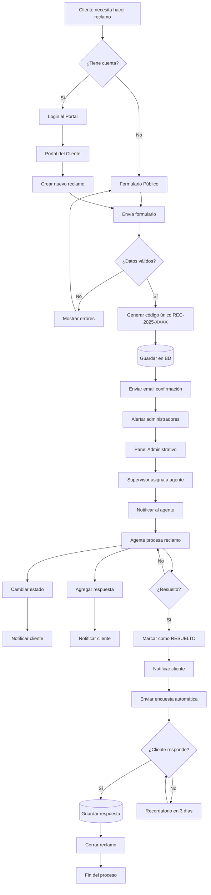

---

## 📝 Flujo 1: Registro de Reclamo (Público)

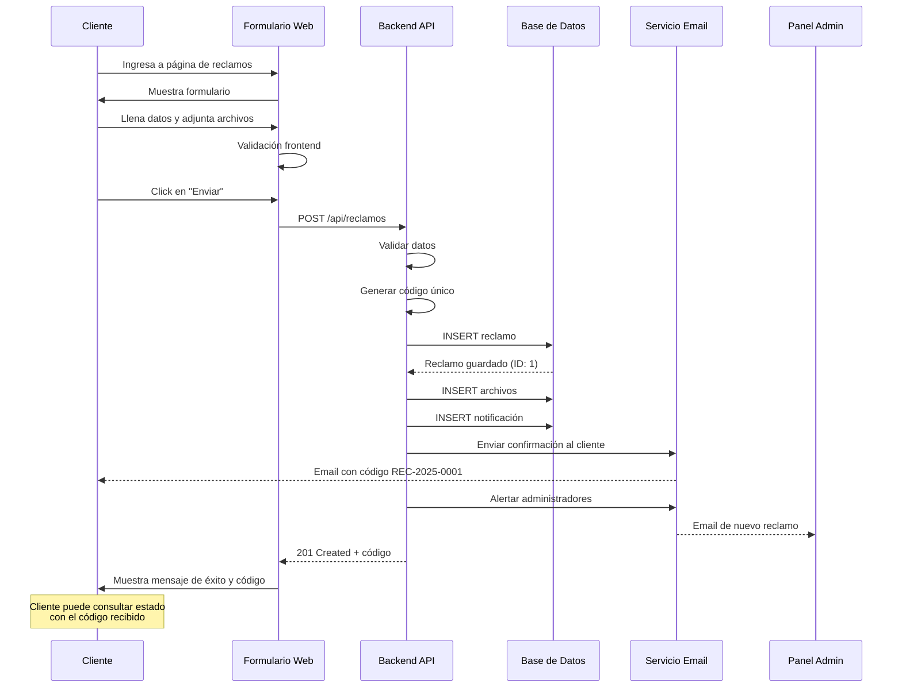

---

## 🔐 Flujo 2: Login y Portal del Cliente

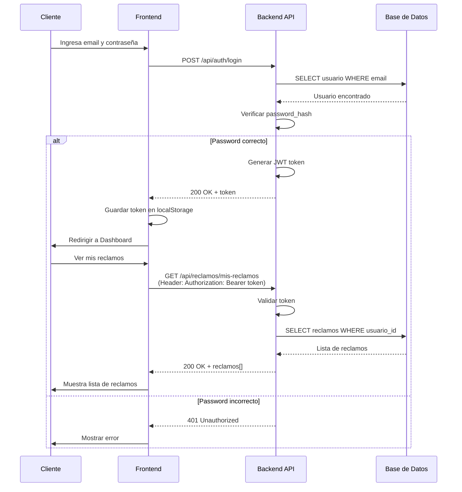

---

## 👨‍💼 Flujo 3: Gestión Interna de Reclamo

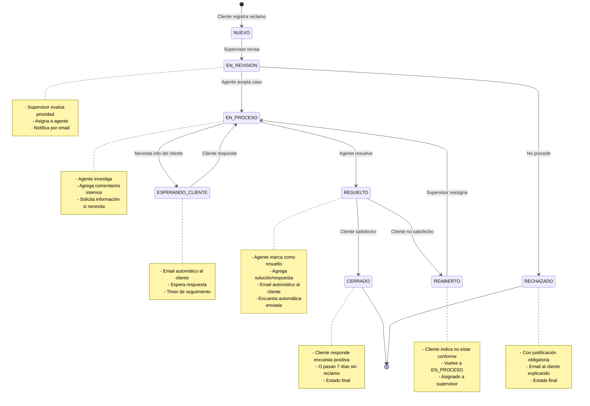

---

## 📊 Flujo 4: Envío de Encuesta Post-Resolución

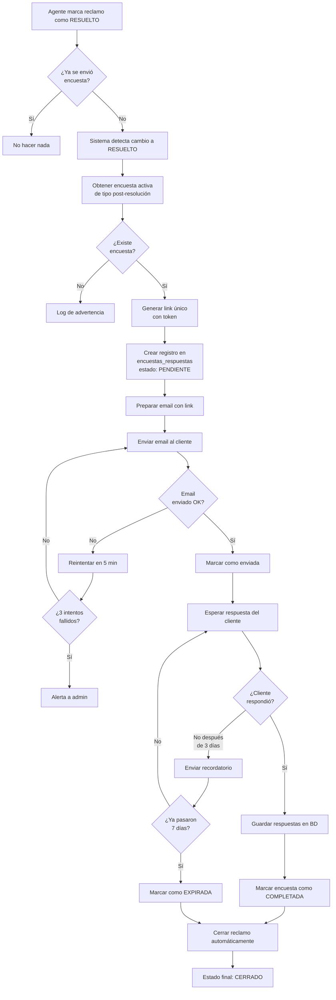

---

## 🔔 Flujo 5: Sistema de Notificaciones

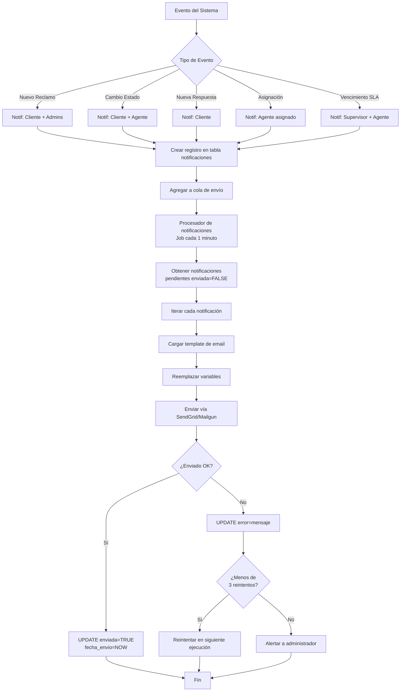

---

## 📱 Flujo 6: Consulta Pública de Estado

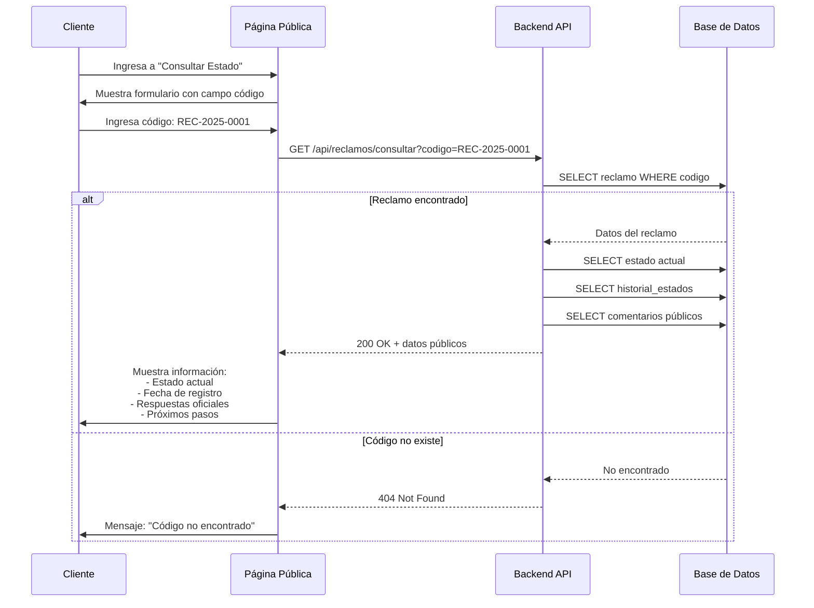

---

## 📁 Flujo 7: Subida de Archivos

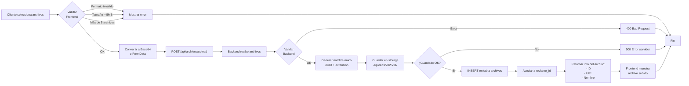

---

## 🔄 Flujo 8: Cambio de Estado con Validaciones

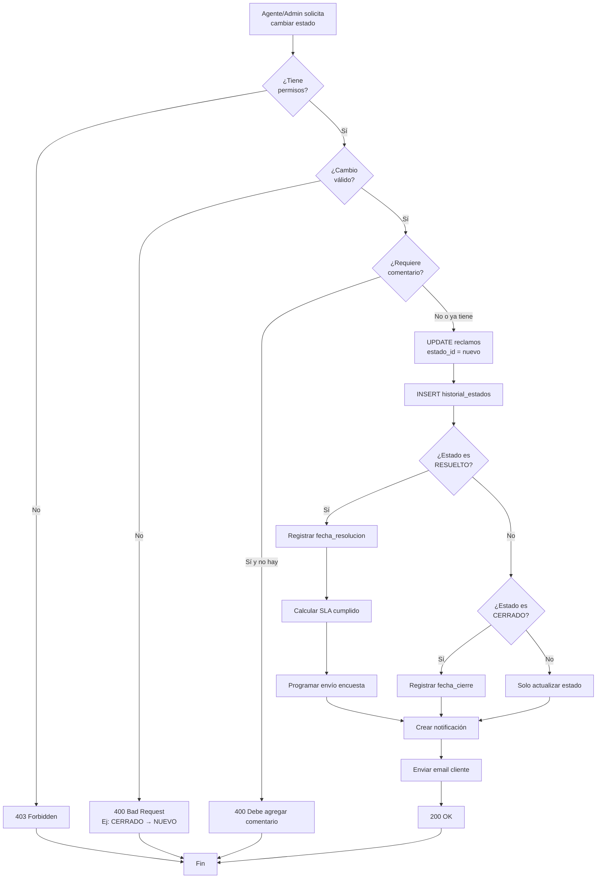

---

## 📈 Flujo 9: Generación de Reportes

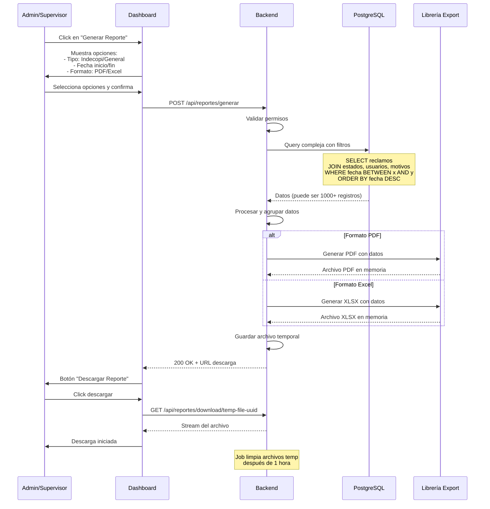

---

## 🎯 Flujo 10: Chat en Tiempo Real (Solo Premium)

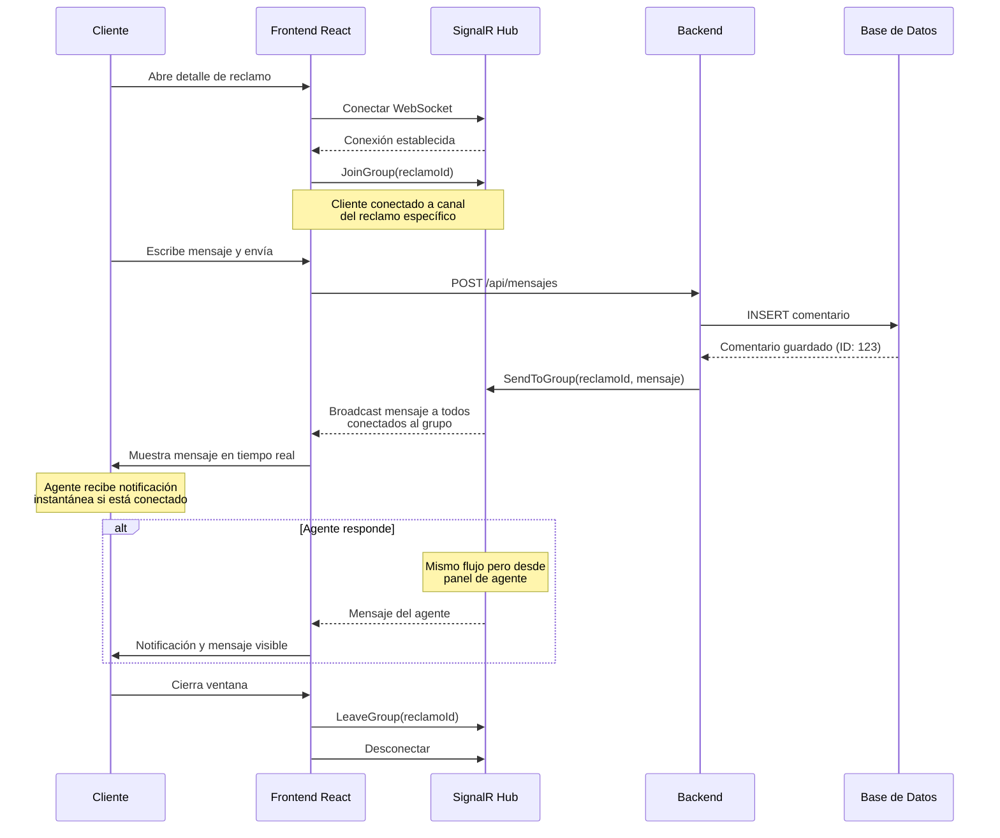

---

## 🔐 Flujo 11: Recuperación de Contraseña

```mermaid
flowchart TD
    A[Cliente: "Olvidé mi contraseña"] --> B[Ingresa email]
    B --> C[POST /api/auth/forgot-password]
    
    C --> D{¿Email<br/>existe?}
    
    D -->|No| E[Responder OK de todos modos<br/>seguridad: no revelar si email existe]
    D -->|Sí| F[Generar token único<br/>UUID + timestamp]
    
    F --> G[UPDATE usuarios<br/>SET reset_token, reset_expiry]
    
    G --> H[Crear link:<br/>https://sistema.com/reset?token=XXX]
    
    H --> I[Enviar email con link]
    I --> J[Mostrar mensaje:<br/>Revisa tu email]
    
    E --> J
    
    J --> K[Cliente abre email]
    K --> L[Click en link]
    
    L --> M[GET /reset-password?token=XXX]
    M --> N{¿Token<br/>válido?}
    
    N -->|Expirado| O[Error: Link expirado]
    N -->|Inválido| O
    N -->|OK| P[Formulario nueva contraseña]
    
    P --> Q[Cliente ingresa nueva password]
    Q --> R[POST /api/auth/reset-password]
    
    R --> S[Validar token nuevamente]
    S --> T[Hashear nueva password]
    T --> U[UPDATE usuarios<br/>password_hash]
    U --> V[Limpiar reset_token]
    
    V --> W[Enviar email confirmación]
    W --> X[Redirigir a login]
    
    O --> End
    X --> End
```

---

## ⏰ Flujo 12: Jobs Automáticos (Background Tasks)

```mermaid
gantt
    title Tareas Programadas del Sistema
    dateFormat HH:mm
    axisFormat %H:%M
    
    section Cada Minuto
    Procesar notificaciones pendientes    :00:00, 1m
    
    section Cada 5 Minutos
    Verificar SLA vencidos                :00:00, 5m
    Reintentar emails fallidos            :00:05, 5m
    
    section Cada Hora
    Limpiar archivos temporales           :00:00, 1h
    Actualizar estadísticas caché         :00:00, 1h
    
    section Diario (2 AM)
    Backup de base de datos               :02:00, 1h
    Limpiar logs antiguos                 :03:00, 30m
    Generar reporte diario                :03:30, 30m
    Enviar recordatorios SLA              :04:00, 30m
    
    section Semanal (Domingo 3 AM)
    Limpiar notificaciones leídas >90d    :03:00, 1h
    Archivar reclamos antiguos            :04:00, 2h
    Optimizar índices BD                  :06:00, 1h
```

---

**Nota:** Todos estos flujos están implementados en el sistema y pueden adaptarse según los requerimientos específicos del cliente.

---

**Documento actualizado:** Noviembre 2025  
**Versión:** 1.0
